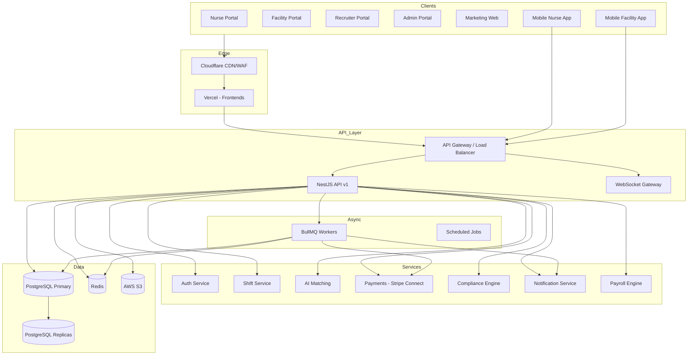

# Sompacare Platform — System Architecture

## Executive Summary

Sompacare is an enterprise healthcare staffing marketplace connecting licensed clinicians (CNAs, LPNs, RNs) with healthcare facilities across North America. The platform supports shift posting, AI-powered matching, GPS-verified timekeeping, payroll, compliance, and multi-portal access for nurses, facilities, recruiters, and administrators.

## Architecture Principles

| Principle | Implementation |
|-----------|----------------|
| Scalability | Stateless API, horizontal pod scaling, read replicas, Redis caching |
| Security | RBAC, JWT + refresh tokens, MFA, audit logs, encryption at rest |
| Reliability | Idempotent webhooks, dead-letter queues, circuit breakers |
| Observability | Sentry, Prometheus metrics, structured logging, distributed tracing |
| Modularity | Turborepo monorepo, domain-driven NestJS modules, shared packages |

## High-Level Architecture



## Monorepo Structure

```
sompacare/
├── apps/
│   ├── web/                 # Marketing site (current root, migration target)
│   ├── admin/               # Enterprise admin dashboard
│   ├── nurse-portal/        # Clinician marketplace & wallet
│   ├── facility-portal/     # Shift management & billing
│   ├── recruiter-portal/    # Candidate pipeline & placements
│   ├── api/                 # NestJS REST + WebSocket API
│   ├── mobile-nurse/        # React Native (Milestone 8)
│   └── mobile-facility/     # React Native (Milestone 8)
├── packages/
│   ├── database/            # Prisma schema & client
│   ├── shared/              # Types, RBAC, constants, validators
│   ├── ui/                  # shadcn/ui design system
│   ├── auth/                # Auth utilities & session helpers
│   ├── notifications/       # Email, SMS, push, in-app
│   ├── payments/            # Stripe Connect integration
│   ├── ai/                  # OpenAI matching, parsing, analytics
│   ├── scheduling/          # Shift scheduling engine
│   ├── compliance/          # License & certification engine
│   └── analytics/           # Metrics & forecasting
├── docs/                    # Architecture & runbooks
├── infrastructure/          # Terraform, Docker, GitHub Actions
└── turbo.json
```

## Technology Decisions

### Frontend
- **Next.js 15 App Router** — SSR, RSC, edge-ready portals
- **shadcn/ui + Tailwind** — Accessible, themeable enterprise UI
- **TanStack Query** — Server state, cache, optimistic updates
- **Zustand** — Lightweight client state (filters, UI prefs)

### Backend
- **NestJS** — Modular DI, guards, interceptors, OpenAPI
- **Prisma** — Type-safe ORM, migrations, connection pooling
- **BullMQ** — Reliable job processing (notifications, payroll, AI)
- **Redis** — Sessions, rate limits, pub/sub, job queues

### Auth
- **Clerk** — OAuth, MFA, organization management, JWT
- Custom RBAC layer maps Clerk users → platform roles & permissions

### Payments
- **Stripe Connect** — Marketplace payouts, instant pay, tax forms

### AI
- **OpenAI GPT-4o** — Resume parsing, shift matching scores, anomaly detection
- Structured outputs via JSON schema for deterministic pipeline integration

## Deployment Topology

| Component | Platform | Environment |
|-----------|----------|-------------|
| Portals (web apps) | Vercel | Preview + Production |
| API | AWS ECS/Fargate or Railway | Staging + Production |
| PostgreSQL | AWS RDS | Multi-AZ |
| Redis | AWS ElastiCache | Cluster mode |
| S3 | AWS S3 | Private buckets + CloudFront signed URLs |
| Workers | AWS ECS (same cluster) | Auto-scaled on queue depth |

## Migration from Current Stack

The existing Sompacare site uses Next.js + Supabase for marketing and a legacy admin module. Migration path:

1. **Milestone 1** — Monorepo + Prisma schema + NestJS API (parallel to legacy)
2. **Milestone 2** — Auth (Clerk) + RBAC across new portals
3. **Milestone 3** — Shift marketplace core; migrate admin shift features
4. **Milestone 4+** — Payroll, compliance, AI; deprecate Supabase admin tables
5. **Final** — Move marketing site to `apps/web`, single PostgreSQL source of truth

## Non-Functional Requirements

| Metric | Target |
|--------|--------|
| API p99 latency | < 200ms (read), < 500ms (write) |
| Uptime | 99.9% |
| Concurrent users | 100K+ (horizontal scale) |
| Shift match computation | < 2s for 500 candidates |
| Data retention | 7 years (healthcare compliance) |
