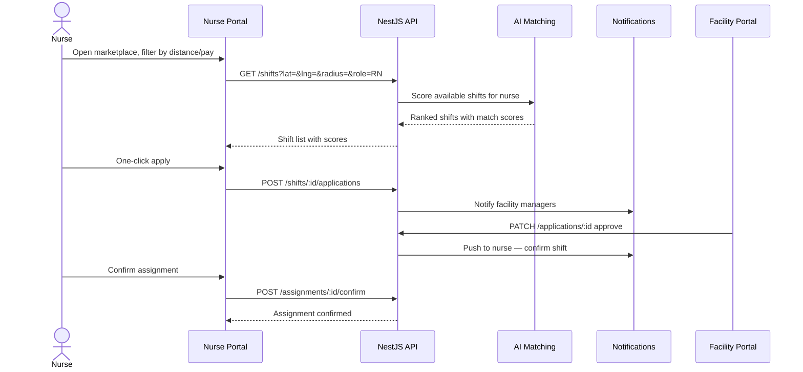
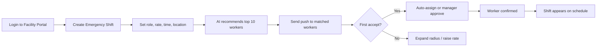

# User Journeys

## 1. Nurse Claims a Per Diem Shift

**Steps:** Search → Filter → View match score → Apply → Wait for approval → Confirm → Add to calendar

---

## 2. Facility Posts Emergency Shift

---

## 3. Clock In → Payroll → Payment

| Step | Actor | Action | System |
|------|-------|--------|--------|
| 1 | Nurse | Arrives at facility, opens app | GPS check within geofence |
| 2 | Nurse | Clock in | ClockEvent created, WebSocket update |
| 3 | Nurse | Clock out after shift | Timecard draft generated |
| 4 | Facility | Approve timecard | Timecard status → APPROVED |
| 5 | Payroll | Generate pay run | PayrollEntry with overtime calc |
| 6 | Admin | Approve pay run | Stripe payout initiated |
| 7 | Nurse | Receive payment | Wallet credited / instant pay |
| 8 | Both | Rate each other | Ratings update match scores |

---

## 4. Recruiter Onboards New CNA

1. Recruiter uploads resume → AI parser extracts skills, licenses, gaps
2. Recruiter moves candidate through pipeline: Applied → Screening → Interview → Offer
3. Compliance officer verifies license via state API / manual review
4. Background check ordered (Checkr webhook → status update)
5. Offer letter sent → candidate accepts
6. Onboarding checklist: documents, orientation, first shift assignment
7. Placement metrics updated on recruiter dashboard

---

## 5. Compliance Expiration Alert

1. Cron job scans licenses/certifications daily
2. 30-day expiration → email + in-app notification to worker
3. 14-day → SMS escalation to worker + recruiter
4. 7-day → compliance officer alert, worker blocked from new applications
5. Expired → shift assignments cancelled, facility notified
6. Renewal uploaded → compliance queue review → access restored

---

## 6. Admin Revenue Dashboard

1. Admin logs in → sees real-time KPIs: revenue, margins, fill rate
2. Drills into facility performance → cancellation rates, avg time-to-fill
3. AI insights panel: predicted shortage next week in Maryland LPN market
4. Exports PDF report for leadership
5. Adjusts feature flag for instant pay in new state

---

## Role → Portal Mapping

| Role | Primary Portal | Key Actions |
|------|----------------|-------------|
| CNA, LPN, RN, Nurse | Nurse Portal | Browse shifts, clock in/out, wallet |
| Facility Manager, Facility Staff | Facility Portal | Post shifts, approve timecards, billing |
| Recruiter | Recruiter Portal | Pipeline, placements, onboarding |
| Admin, Super Admin | Admin Portal | Full system management |
| Payroll | Admin → Payroll | Pay runs, approvals, exports |
| Compliance Officer | Admin → Compliance | Verify docs, audit |
| Finance | Admin → Finance | Invoices, revenue reports |
| Customer Support | Admin → Support | Tickets, user assistance |
